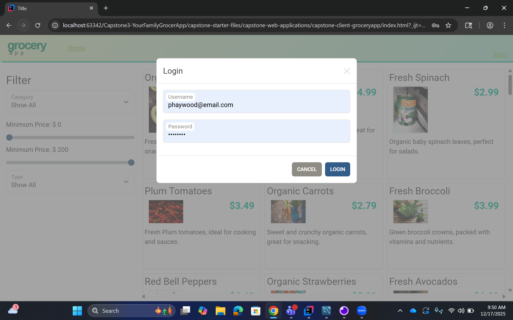
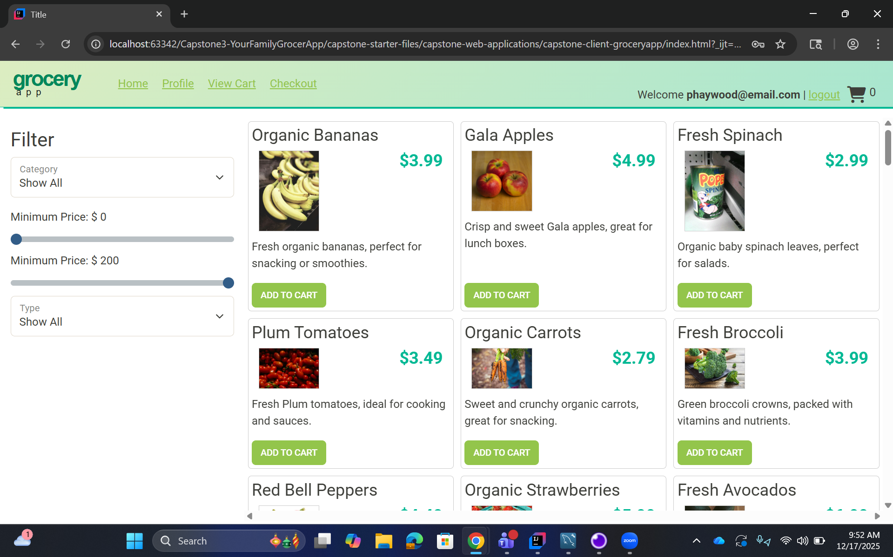
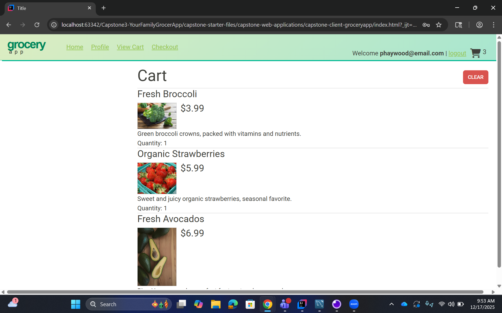
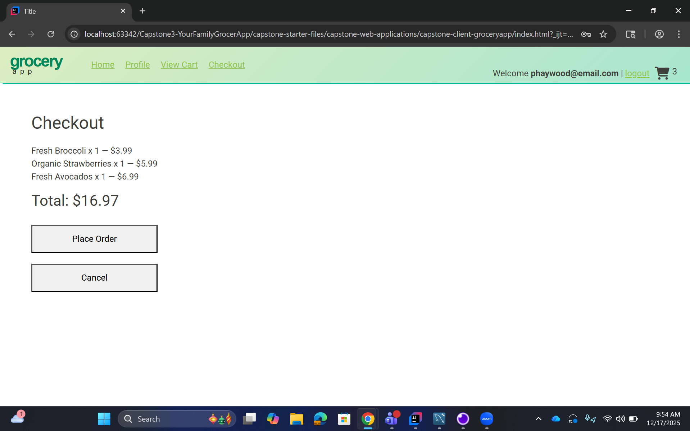

# 🛒 Your Family Grocer App

A full‑stack e‑commerce grocery application built as a **Spring Boot API capstone project**. This project demonstrates backend API design, security with JWT authentication, MySQL persistence, and a dynamic client application that consumes the API.
---
## 📚 Table of Contents

- [Project Overview](#-project-overview)
- [Tech Stack](#-tech-stack)
- [Project Structure](#-project-structure)
- [Features](#-features)
- [Database Schema](#-database-schema)
- [REST Endpoints](#-rest-endpoints)
- [Example JSON Requests](#-example-json-requests)
- [Installation Run Instructions](#-installation-run-instructions)
- [Interesting Code Snippet](#-interesting-code-snippet)
- [Landing Pages and UML Diagram](#-landing-pages-and-uml-diagram)
- [Author](#-author)
---

## 📌 Project Overview

**Your Family Grocer App** is an online grocery store that allows users to:

* Browse products by category
* Filter products
* Log in with JWT authentication
* Add products to a shopping cart
* View and manage their profile
* Checkout and place orders

Administrators can additionally:

* Manage product categories
* Create, update, and delete products

This project was built as part of **Capstone 3 – E‑Commerce API**.

---

## 🧰 Tech Stack

### Backend

* Java 17
* Spring Boot
* Spring Security + JWT
* Spring MVC (REST Controllers)
* JDBC / DAO Pattern
* MySQL
* Maven
* JUnit 5 & MockMvc (Testing)

---

## 🗂️ Project Structure

```
Capstone3-YourFamilyGrocerApp
│
├── capstone-api-starter        # Spring Boot REST API
│   ├── src/main/java/org/yearup
│   │   ├── configurations      # App configuration
│   │   ├── controllers         # REST controllers
│   │   ├── data/mysql          # DAO implementations
│   │   ├── models              # Domain models
│   │   ├── security/jwt        # JWT auth + filters
│   │   └── service             # Business logic
│   └── src/test/java/org/yearup
│       ├── controllers         # Controller tests
│       └── data/mysql          # DAO tests
│
└── capstone-web-applications   # Frontend client
   └── capstone-client-groceryapp
        ├── css
        ├── images
        ├── js
        │   └── services        # Client-side services
        └── templates           # Html templates
```

---

## ✨ Features

### User Features

* User registration & login
* JWT-based authentication
* Profile management
* Product browsing & filtering
* Shopping cart management
* Checkout flow

### Admin / System Features

* Secure REST API
* Stateless authentication
* Role-based access control
* DAO-driven persistence layer
* Clean separation of concerns

---

## 🗄️ Database Schema

Key tables include:

* `users`
* `orders`
* `products`
* `profiles`
* `categories`
* `shopping_cart`
* `order_line_items`

---

## 🌐 REST Endpoints

### Authentication

* `POST http://localhost:8080/register`
* `POST http://localhost:8080/login`

### Products

* `GET http://localhost:8080/products`
* `GET http://localhost:8080/products/{id}`

### Categories

* `GET http://localhost:8080/categories`

### Shopping Cart

* `GET http://localhost:8080/cart`
* `POST http://localhost:8080/cart/products/{productId}`
* `PUT http://localhost:8080/cart/products/{productId}`
* `DELETE http://localhost:8080/cart`

---

## 📦 Example JSON Requests

### Login

* `POST http://localhost:8080/login`
```json
{
  "username": "Prince87",
  "password": "password123"
}
```

### Add Product to Database

* `POST http://localhost:8080/products`
```json
{
  "productId": 63,
  "name": "Teriyaki Chicken",
  "price": 6.99,
  "categoryId": 1,
  "description": "Delicious chicken marinated in teriyaki sauce",
  "subCategory": "Fresh",
  "stock": 50,
  "imageUrl": "teriyaki-chicken.jpg",
  "featured": true
}
```

---

## ▶️ Installation Run Instructions

### Installation

Clone the repository from GitHub:

```bash
git clone https://github.com/praytoo/Capstone3-YourFamilyGrocerApp.git
cd Capstone3-YourFamilyGrocer
```
Build the project using Maven:
```
mvn clean install
```

### Run

```
mvn spring-boot:run
```

API runs at `http://localhost:8080`

---

## 🧠 Interesting Code Snippet

### Products Controller Add A Product

```java
//add product
//only admin can use this function
@PostMapping()
@PreAuthorize("hasRole('ROLE_ADMIN')")
public Product addProduct(@RequestBody Product product)
{
    try
    {
        return productService.create(product);
    }
    catch(Exception ex)
    {
        throw new ResponseStatusException(HttpStatus.INTERNAL_SERVER_ERROR, "Oops... our bad.");
    }
}

```
Why it is interesting: this piece of code is interesting because it alone allows you to add a new product to the database if you have admin authorization. This line is what makes it admin restrictive:
```dart
@PreAuthorize("hasRole('ROLE_ADMIN')")
```
While these lines produce the ability to add a new product:
```java
@PostMapping()
public Product addProduct(@RequestBody Product product)
{
    try
    {
        return productService.create(product);
    }
    catch(Exception ex)
    {
        throw new ResponseStatusException(HttpStatus.INTERNAL_SERVER_ERROR, "Oops... our bad.");
    }
}
```

---

## 🖼️ Landing Pages and UML Diagram

* Website Walk Through:

* API Testing:

* Login Page:

* Product Catalog:

* Shopping Cart:

* Checkout Page:

* UML Diagram:


---

## 👤 Author

**Prince Haywood**
Playa Vista, CA

---

## ✅ License

This project is for educational purposes as part of Year Up United: Learning to Code Academy capstone 3.
